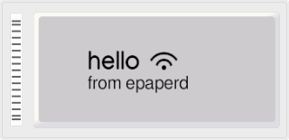

# `libepaper-central`

_A lightweight image sender library for ZigBee USB sticks running the cc2531-OEPL OpenEPaperLink station firmware._

## About

This C library acts as a serial-driver for CC2531-based ZigBee USB sticks. It can be used to transmit bi-color images to hacked supermarket price-tags via the [OpenEPaperLink](https://openepaperlink.de/) protocol (tested with OpenEPaperLink v1.9.0).

The data-source are generic rgb pixel-arrays, which could be fully generated in memory with no need for intermediate files.

## API

To integrate libepaper-central in your project, head over to the [docs](https://epaper-central.readthedocs.io/).

## Usage (command-line)

The library comes with a standalone reference-program "epaperd" which picks up [PPM images (P6)](https://en.wikipedia.org/wiki/Netpbm#Description) from a folder and sends them to nearby OpenEPaperLink displays.

The program will check for files named after tag mac addresses (e.g. 00112233aabbccdd.ppm for a tag with mac address `00:11:22:33:aa:bb:cc:dd`) and falls back to `default.ppm` if no specific image exists for a tag – in this case the mac address will be visible on the display in addition until an applicable .ppm-file becomes available in the cache folder.

```bash
> epaperd [/cache/directory]
```

## Compatible Hardware

The library is compatible with CC2531-based ZigBee USB sticks running the cc2531-OEPL station firmware.

The firmware can be obtained from [Jonas Niesners OpenEPaperLink repository](https://github.com/jonasniesner/OpenEPaperLink/blob/4aaffbacd4ebee760c0c4088e069e5ba60e4a219/ARM_Tag_FW/cc2531_OEPL/cc2531_OEPL_beta.hex) – for flashing there's several options available:

1. Using a proprietary [CC Debugger](https://www.ti.com/tool/CC-DEBUGGER) adapter
2. Using a Raspberry Pi (or other single-board computer) via [cc2531-flasher-pi](https://github.com/leso-kn/cc2531-flasher-pi)
3. Using an esp32 (see [https://youtu.be/98fOzZs__fc](https://youtu.be/98fOzZs__fc?t=170))

## License

libepaper-central is licensed under the MIT License.

## Changelog

### v0.1.0

* Initial version of the library
  * Transmit images from generic rgb pixel-arrays
  * Simple "epaperd" reference-program to load .ppm-images from a folder and transmit them to price-tags

---

Created by [Lesosoftware](https://github.com/leso-kn) in 2023
